# Florys Blog 

Project milestone 4 for Code Institute Full-stack development program.
This project is a Full Stack website built using the Django framework. Florys Blog is a multipurpose
blog, but with the nature as being the main theme.
The Users can create, look, edit and delete a blog post. When the user is logged in, they can also 
like/unlike a post and comment on a post. They can also share their ideas by adding a post 
on the Blog and upload or update their user image and details.

[Live Project Here](https://florys-app.herokuapp.com/)

README Table Content

- [Florys Blog - Introduction](#florys-blog)
  - [User Experience - UX](#user-experience---ux)
    - [User Stories](#user-stories)
    - [The Scope](#the-scope)
      - [Main Site Goals](#main-site-goals)
  - [Design](#design)
      - [Colours](#colours)
      - [Typography](#typography)
      - [Imagery](#imagery)
  - [Database Diagram](#database-diagram)
  - [Features](#features)
  - [Languages](#languages-used)
  - [General Tools](#frameworks---libraries---programs-used)
  - [Testing](#testing)
  - [Creating The Django App](#creating-the-django-app)
  - [Deployment](#deployment-of-this-project)
  - [Forking](#forking-this-project)
  - [Credits](#credits)
    

## User Experience - UX

### User Stories

* As logged in website user, I can:

1. Like/unlike posts.
2. Comment on posts.
3. Delete my previous comments. (work in progress...)
4. Manage my profile by updating my details and user image.
5. Edit my post posted previously.
6. Delete my post posted previously.
7. Logout from the website.

* As a website superuser, I can:

1. Create and publish a new post.
2. Create draft posts that can be reviewed and finalised later.
3. Create a new user, post, comments, and categories.
4. Delete user, comments, and posts.
5. Edit user's posts that was posted previously.
6. Delete user's posts that was posted previously.

### Agile Methodology

All functionality and development of this project were managed using GitHub which Projects can be found
[here](https://github.com/users/sebhd1/projects/4)

### The Scope

#### Main Site Goals

* To provide users with a good experience when using the website to document something.
* To provide users with a visually pleasing website that is intuitive to use and easy to navigate.
* To provide a website with a clear purpose.
* To provide role-based permissions that allows user to interact with the website.

## Design

#### Colours

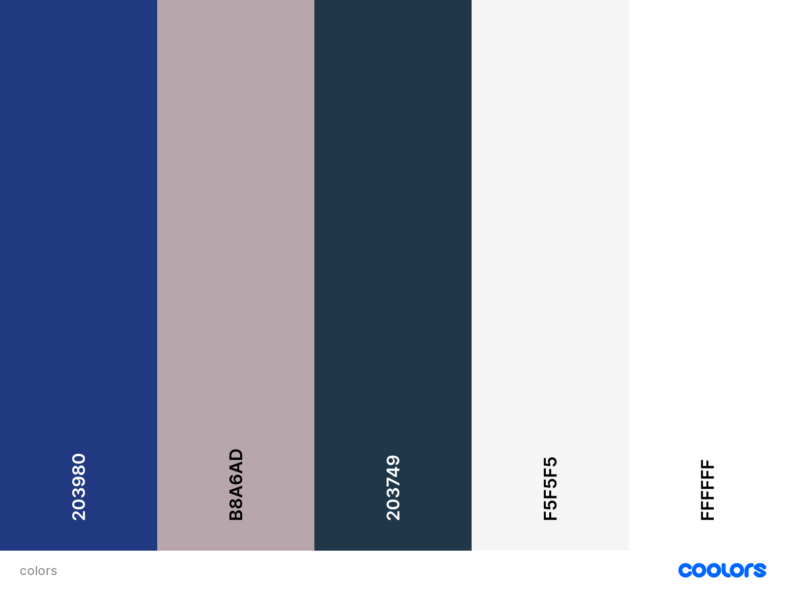

* The colour scheme is kept simple and for a minimal style blog like.

#### Typography

* The Roboto Mono font is used as the main font for the whole project.

#### Imagery

* All the imagery is related to the posts and website design. Only 3 images are static.
The remaining imagery will be uploaded by the author to the database.

## Database Diagram

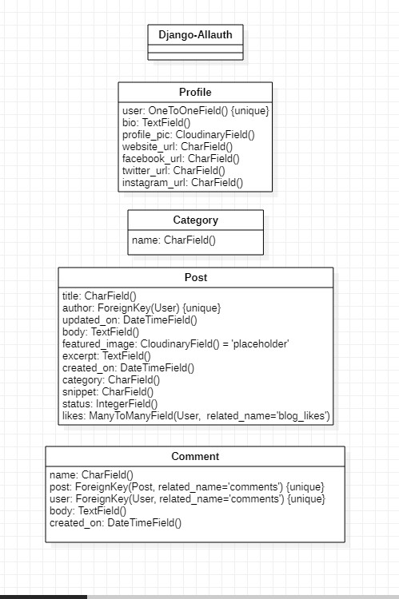 

In a simple blog app that uses Django and django-allauth for authentication, the relationships between the entities can be modeled as follows:

Authentication and Profile: django-allauth provides authentication functionality, which can be used to authenticate users in the blog app. Once a user is authenticated, their profile can be created and associated with their user account. This is a one-to-one relationship between the authentication and profile entities, as a single authentication instance is associated with only one profile.

Profile and Post: Each profile can have multiple posts associated with it. This is a one-to-many relationship between the profile and post entities, as a single profile can have multiple posts, but each post is associated with only one profile.

Category and Post: Each post can be assigned to one or more categories. This is a many-to-many relationship between the category and post entities, as a single category can have multiple posts associated with it, and a single post can be assigned to multiple categories(although in the case of Florys a post can only have one Category at the moment!).

Profile and Comment: Each profile can have multiple comments associated with it. This is a one-to-many relationship between the profile and comment entities, as a single profile can have multiple comments, but each comment is associated with only one profile.

Post and Comment: Each post can have multiple comments associated with it. This is a one-to-many relationship between the post and comment entities, as a single post can have multiple comments, but each comment is associated with only one post.

These relationships can be represented in a database schema using foreign keys and many-to-many relationships. For example, the post table could have a foreign key that references the profile table to establish the relationship between posts and profiles, and a many-to-many relationship could be used to establish the relationship between categories and posts.

## Features

The overall blog style is intended to be minimal and intuitive.

### Home Page
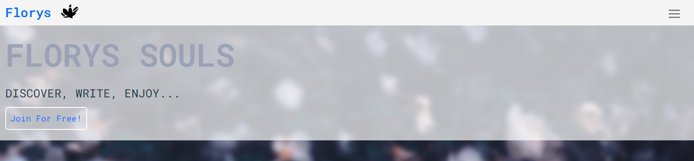
* The hero image welcomes the user with a short message advertising what the website is about. 

### Home Page - Highlight Posts
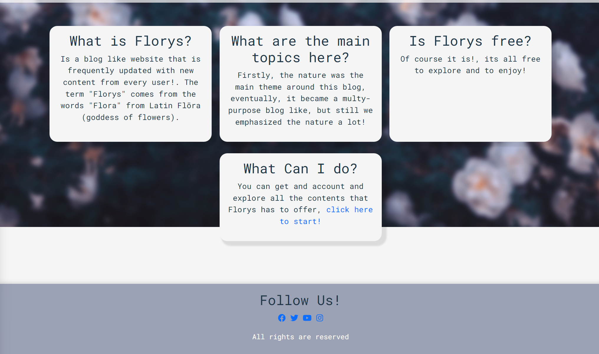
* In this section of the homepage, users can get an idea about Florys and what it is about. 

## Login Page 
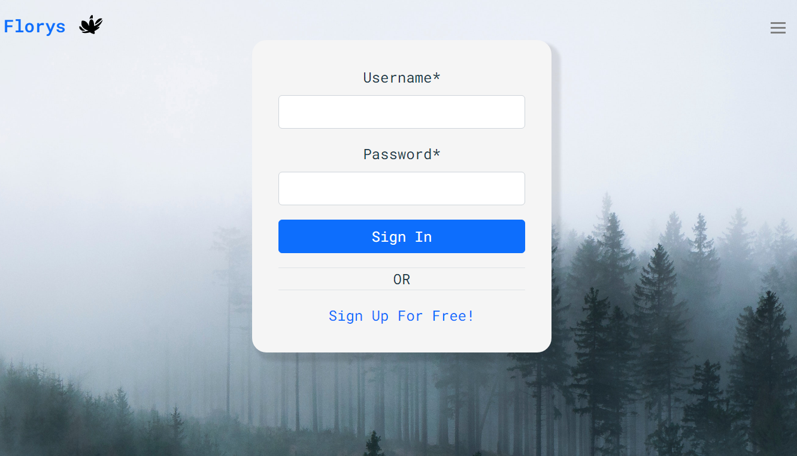
* The user can sign in just with a username and password.

## Register Page
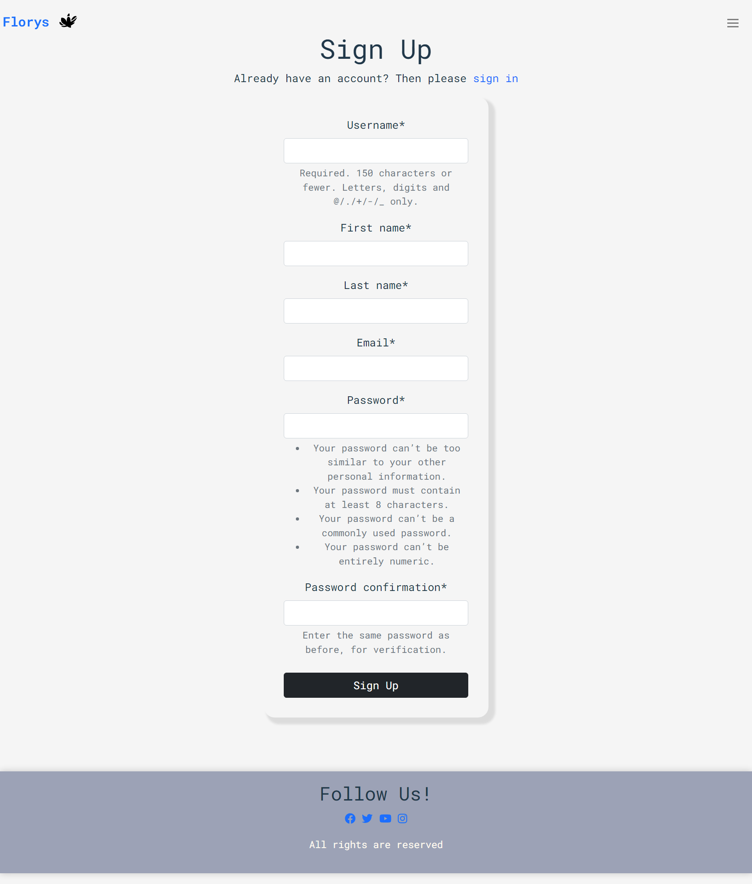
* The user can register by filling up all the required fields. It will be then redirect to the login screen.

## Blog 
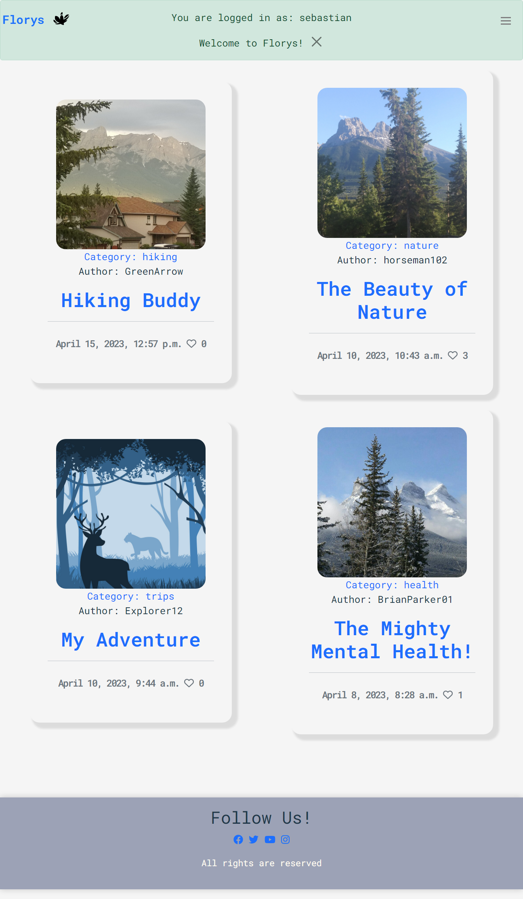
* In the Blog section, the user can view all the blog post created by others.

## Blog - Categories
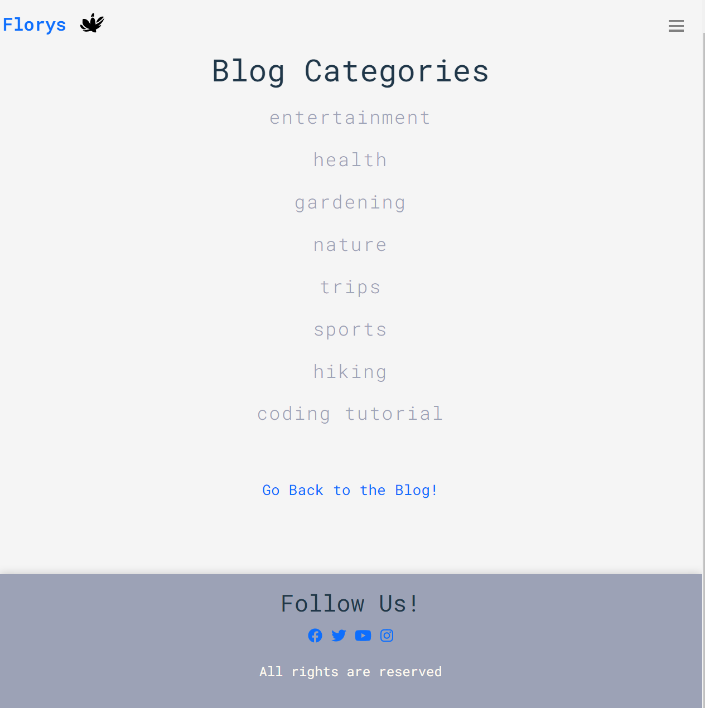
* This section is for the user to look up for a specific category, on click, it will open only the posts within that category

## Blog - Add Post
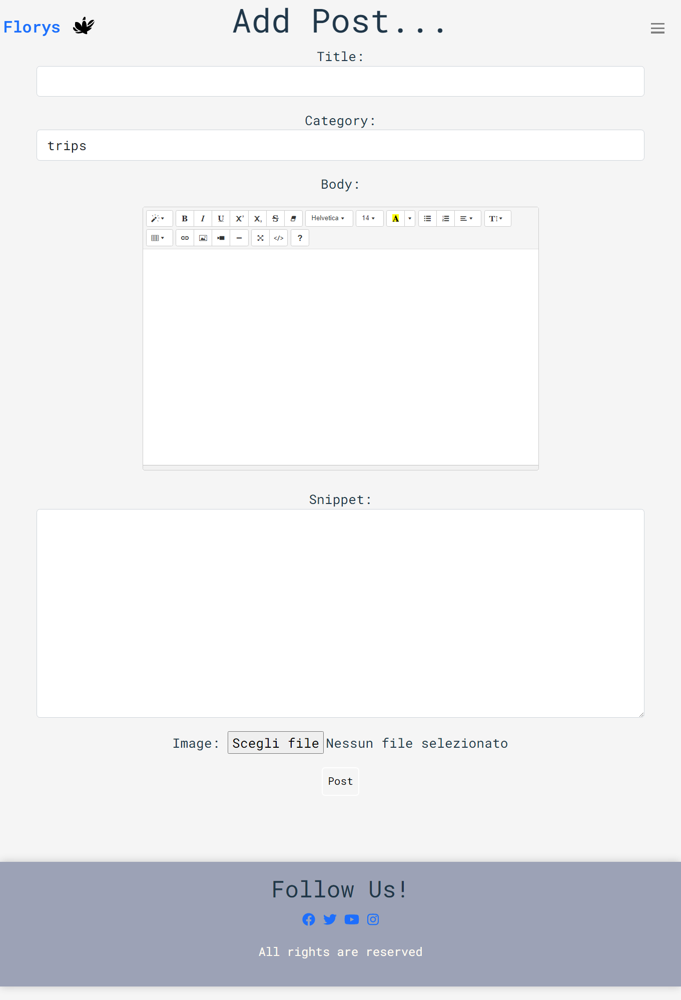
* Here is where the user can create a post to be viewed by all the users in the blog section.

## Blog - Edit / Delete Post
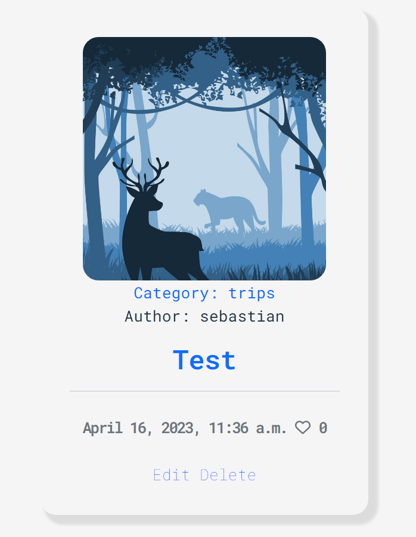
* The creator can update or delete only its own posts.

## Blog - Post Comments / Likes
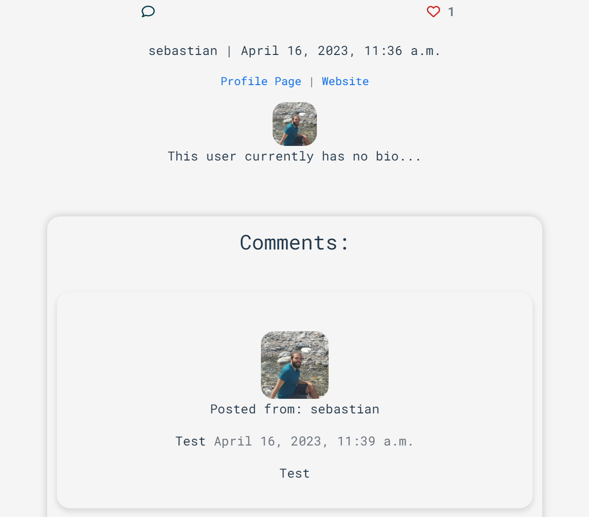
* The user can register by filling up all the required fields. It will be then redirect to the login screen.

## Blog - User Settings
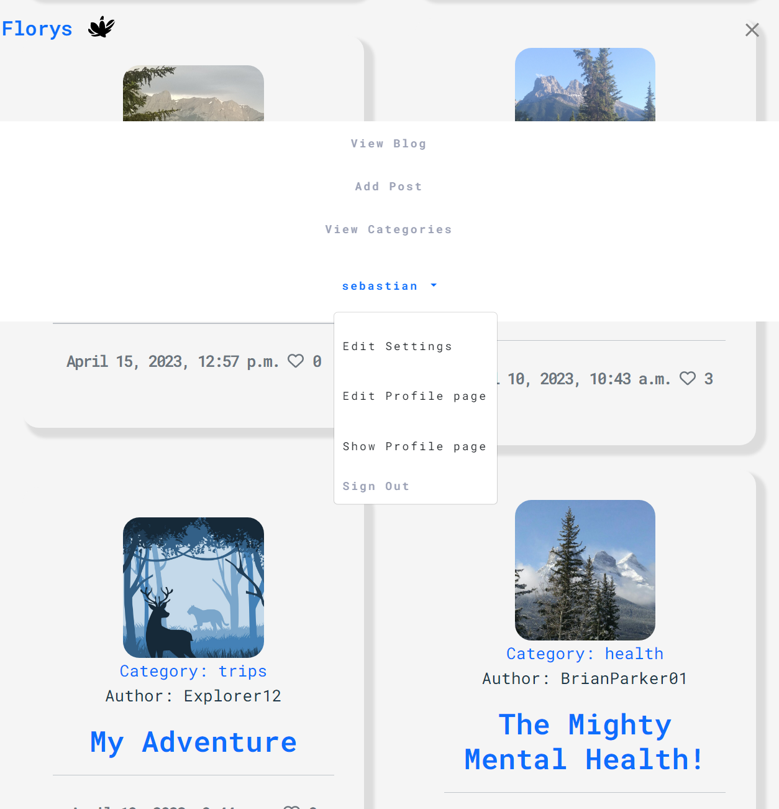
* I decided to group all the user settings under the dropdown menu, where the user can edit the profile and the personal settings.
If the user is new, it can create its own personal profile with a bio, links ecc.. 

## Admin Panel/Superuser
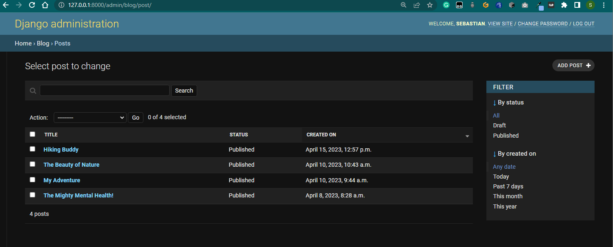

* On the Admin Panel, as an admin/superuser I have full access to CRUD functionality, so I can view, create, edit and
delete the following ones:
1. Posts
2. Comments
3. Author
4. Categories
5. Profiles

### Languages Used

* [HTML 5](https://en.wikipedia.org/wiki/HTML/)
* [CSS 3](https://en.wikipedia.org/wiki/CSS)
* [JavaScript](https://www.javascript.com/)
* [Django](https://www.python.org/)
* [Python](https://www.djangoproject.com/)

#### Django Packages

* [Gunicorn](https://gunicorn.org/) 
   As the server for Heroku
* [Cloudinary](https://cloudinary.com/) 
   Was used to host the static files and media
* [Dj_database_url](https://pypi.org/project/dj-database-url/) 
   To parse the database URL from the environment variables in Heroku
* [Psycopg2](https://pypi.org/project/psycopg2/) 
   As an adaptor for Python and PostgreSQL databases
* [Summernote](https://summernote.org/) 
   As a text editor
* [Allauth](https://django-allauth.readthedocs.io/en/latest/installation.html) 
   For authentication, registration, account
   management
* [Crispy Forms](https://django-crispy-forms.readthedocs.io/en/latest/) 
   To style the forms

### Frameworks - Libraries - Programs Used

* [Bootstrap](https://getbootstrap.com/) 
   Was used to style the website, add responsiveness and interactivity
* [Git](https://git-scm.com/) 
   Git was used for version control by utilizing the Gitpod terminal to commit to Git and push to GitHub
* [GitHub](https://github.com/) 
   GitHub is used to store the project's code after being pushed from Git
* [Heroku](https://id.heroku.com) 
   Heroku was used to deploy the live project
* [PostgreSQL](https://www.postgresql.org/) 
   Database used through heroku.
* [PyCharm](https://www.jetbrains.com/pycharm/) 
   PyCharm was used to create and edit the website
* [Lucidchart](https://lucid.app/) 
   Lucidchart was used to create the database diagram
* [PEP8](http://pep8online.com/) 
   PEP8 was used to validate all the Python code
* [W3C - HTML](https://validator.w3.org/) 
   W3C- HTML was used to validate all the HTML code
* [W3C - CSS](https://jigsaw.w3.org/css-validator/) 
   W3C - CSS was used to validate the CSS code
* [Fontawesome](https://fontawesome.com/) 
   To add icons to the website
* [Google Chrome Dev Tools](https://developer.chrome.com/docs/devtools/) 
   To check App responsiveness and debugging
* [Google Fonts](https://fonts.google.com/) 
   To add the 2 fonts that were used throughout the project

### Testing
Testing results [here](TESTING.md)

## Creating the Django app

1. Go to the Code Institute Gitpod Full Template [Template](https://github.com/Code-Institute-Org/gitpod-full-template)
2. Click on Use This Template
3. Once the template is available in your repository click on Gitpod
4. When the image for the template and the Gitpod are ready open a new terminal to start a new Django App
5. Install Django and gunicorn: `pip3 install django gunicorn`
6. Install supporting database libraries dj_database_url and psycopg2 library: `pip3 install dj_database_url psycopg2`
7. Create file for requirements: in the terminal window type `pip freeze --local > requirements.txt`
8. Create project: in the terminal window type django-admin startproject your_project_name
9. Create app: in the terminal window type python3 manage.py startapp your_app_name
10. Add app to the list of installed apps in settings.py file: you_app_name
11. Migrate changes: in the terminal window type python3 manage.py migrate
12. Run the server to test if the app is installed, in the terminal window type python3 manage.py runserver
13. If the app has been installed correctly the window will display The install worked successfully! Congratulations!

## Deployment of This Project

* This site was deployed by completing the following steps:

1. Log in to [Heroku](https://id.heroku.com) or create an account
2. On the main page click the button labelled New in the top right corner and from the drop-down menu select Create New
App
3. You must enter a unique app name
4. Next select your region
5. Click on the Create App button
6. Click in resources and select Heroku Postgres database
7. Click Reveal Config Vars and add a new record with SECRET_KEY
8. Click Reveal Config Vars and add a new record with the `CLOUDINARY_URL`
9. Click Reveal Config Vars and add a new record with the `DISABLE_COLLECTSTATIC = 1`
10. The next page is the project’s Deploy Tab. Click on the Settings Tab and scroll down to Config Vars
11. Next, scroll down to the Buildpack section click Add Buildpack select python and click Save Changes
12. Scroll to the top of the page and choose the Deploy tab
13. Select Github as the deployment method
14. Confirm you want to connect to GitHub
15. Search for the repository name and click the connect button
16. Scroll to the bottom of the deploy page and select the preferred deployment type
17. Click either Enable Automatic Deploys for automatic deployment when you push updates to Github

## Final Deployment 

1. Create a runtime.txt `python-3.8.13`
2. Create a Procfile `web: gunicorn your_project_name.wsgi`
3. When development is complete change the debug setting to: `DEBUG = False` in settings.py
4. In Heroku settings, delete the config vars for `DISABLE_COLLECTSTATIC = 1`

## Forking This Project

* Fork this project by following the steps:

1. Open [GitHub](https://github.com/sebhd1/florys)
2. Find the 'Fork' button at the top right of the page
3. Once you click the button the fork will be in your repository

## Cloning This Project

* Clone this project by following the steps:

1. Open [GitHub](https://github.com/sebhd1/florys)
2. You will be provided with three options to choose from, HTTPS, SSH or GitHub CLI, click the clipboard icon in order
to copy the URL
3. Once you click the button the fork will be in your repository
4. Open a new terminal
5. Change the current working directory to the location that you want the cloned directory
6. Type 'git clone' and paste the URL copied in step 3
7. Press 'Enter' and the project is cloned

## Credits

### Content

- I used fonts from [Google Fonts](https://fonts.google.com/) for this project.

- I used Stack Overflow for general troubleshooting and issues with grid spacing.

- Feedback and comments from the reviewer of my portfolio project number 1/2/3 were taken into account for this project when running tests and identifying and fixing bugs.

* The static images were taken from [Unsplash](https://unsplash.com/)

### Information Sources / Resources

* [W3Schools - Python](https://www.w3schools.com/python/)
* [Stack Overflow](https://stackoverflow.com/)
* [Scrimba - Pyhton](https://scrimba.com/learn/python)

### Acknowledgements
This application was executed and completed as a portfolio 4 Project for the full stack diploma at [Code Institute](https://codeinstitute.net/).

Sebastiano Ballotta, 2023.
