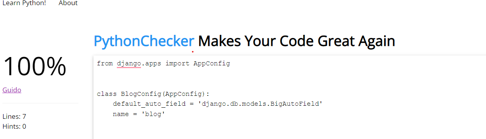
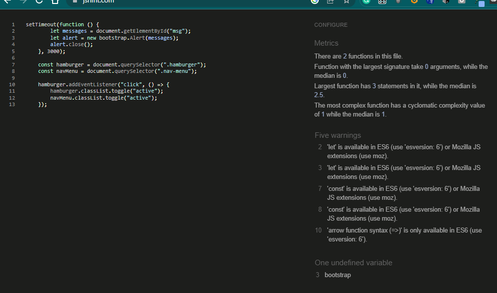

# Testing
Back to the [README](README.md)

Testing has taken place continuously throughout the development of the project. Each view was tested regularly. 
  When the outcome was not as expected, debugging took place at that point.  

### Python Validation - PEP8
* Python testing was done using the PEP8 Online to ensure there were no syntax errors in the project. All python files
were entered into the online checker and no errors were found in any of the custom codes.

### Florys - Blog

- admin.py

- apps.py

- forms.py

- models.py

- urls.py

- views.py

### Florys - florys

- urls.py

- views.py

### Florys - members

- forms.py

- views.py

- urls.py

### Lighthouse
Lighthouse was used to test Performance, Best Practices, Accessibility and SEO on Desktop.

##### Desktop Results:

###### Mobile Results:

### HTML Validation

### CSS Validation

* Custom CSS was validated using W3C Jigsaw validation service. The warnings show an issue with the aspect-ratio, however, 
the aspect-ratio is set and working properly and therefore is a false positive. It will not affect the CSS performance.

### JavaScript Validation

* Although it displays those messages, I can ensure that the functionalities are there and that the messages are working fine. 

## Manual Testing
### Frontend
* The Signup, Login and system has no issues and is working accordingly. It shows the right 
  interactive message to the users. (only when logging out no messages are shown)
* The Profile Page is working properly. It updates the user information and uploads/updates the 
  user profile image. It shows the interactive message to the user once the update is complete.
* The Post Details page has no issues and shows the user image and user info (owner of the post).
* All the internal links are working and bring the user to the right page on the website.
* All the external links are working and bring the user to the right social media page by opening a new browser tab.
* The Categories Page shows all the available categories.
* The drop-down menu in the navbar shows a list of categories on every page of the website.

* The pagination system is working. It adds another page after 6 posts on the page.
* On the Post Details Page, the Like/unlike functionality is working without issues.
* The comment form has no issues, and it submits a new comment once the form is completed by a
  registered user. 
  The comment is displayed once the submit button is pressed. The interactive message for 
  this action is working without errors. 

* On the Blog, the CRUD functionality is working without issues. Logged in users can create a new 
  post such as update or delete their own posts, also any post can be updated or deleted by the owner.  

### Backend/Admin Panel
* I have tested the Admin Panel repeatedly since the start of the project development. All the models are working without issues.  
  I have created, deleted, and updated data in all models without errors. The models have the behavior expected for what they were built for.

### Manual Test Case
The Test case for this project can be found [here](https://docs.google.com/spreadsheets/d/1CiuYo534FCLScvpeDLh2PPmHYfuY1Ati7bLFGkS_Fq4/edit?usp=sharing)

## Bugs

- As you can see from the screenshots, the functionalities to upload custom images for the blog and the profile were working before on this project. 
this issue is due to some S3 bucket policy, but the placeholder images get uploaded correctly if nothing is there, otherwise it retrieve an error. 
Whenever adding / editing a post or a profile, I would suggest to leave the images field blank so the post gets created with the placeholder image and the same during the profile creation. 
I am also aware that this project does not require AWS, and it was my personal choice.

- I initially implemented the login with google and github but, it was working fine at first, but as the application got bigger,
it started to present some bugs do I removed both. 

- Although the checks are performed in the settings.py as not only, the email on the register form does not appear to be registered unique.
This is a bug that I will be planning to address in the future.

- I had a couple of issues during the deployment phase, with the config and general settings in Heroku, but the app is running fine.

## Resolved Issue

- I was able to address the image uploading issue, now the user can upload a profile image as well as a picture for the post.

## Further Implementations

- Resolving the previous mentioned bugs.
- The user cannot delete a profile at the moment, this is something that I am planning to implement.
- Login with third parties, such as google and/or GitHub.

Overall the application works, and it is supposed to do what it says, which is blogging. 
There are no major unfixed issues, the user is able to register, login and start blogging. 

All the images and posts have been created just to showcase the project, the users are personally made by myself and all the images are taken from pexels.com.
Some articles are taken from official font such as [Wikipedia](https://www.wikipedia.org/), [Laravel](https://laravel.com/) and [Composer](https://getcomposer.org/)